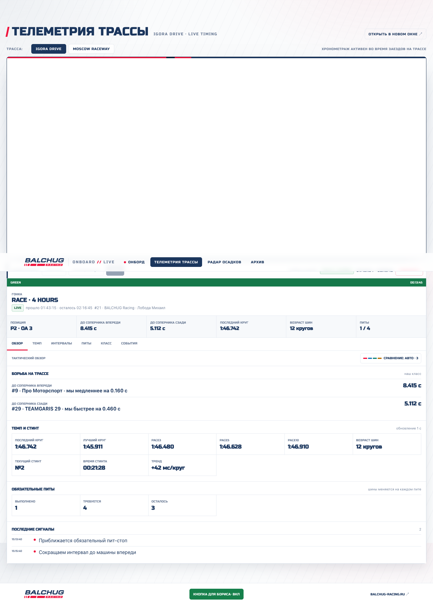
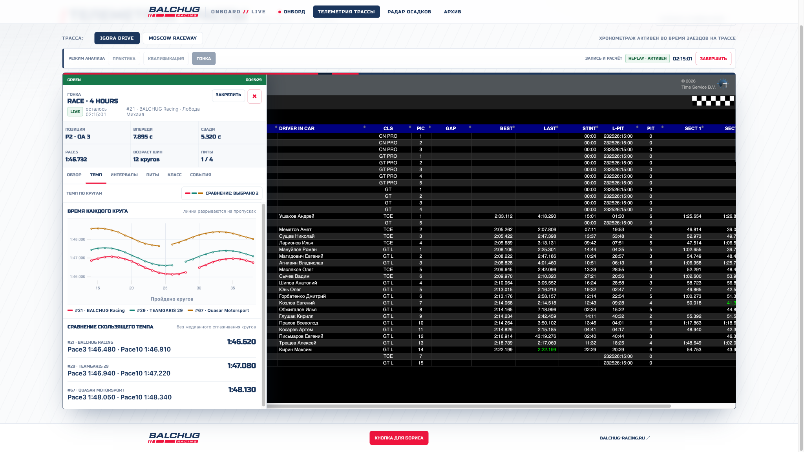
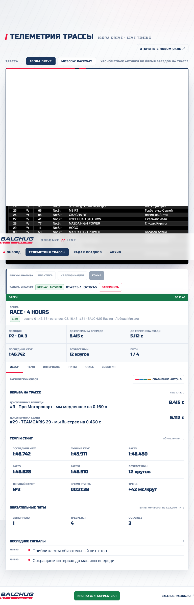
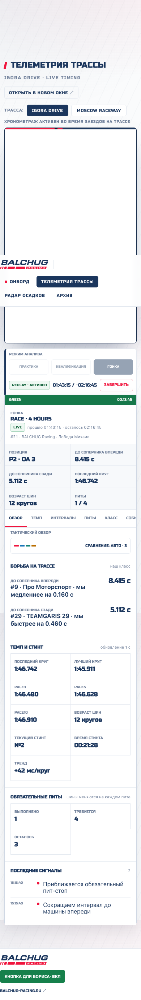
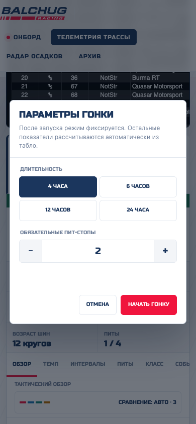
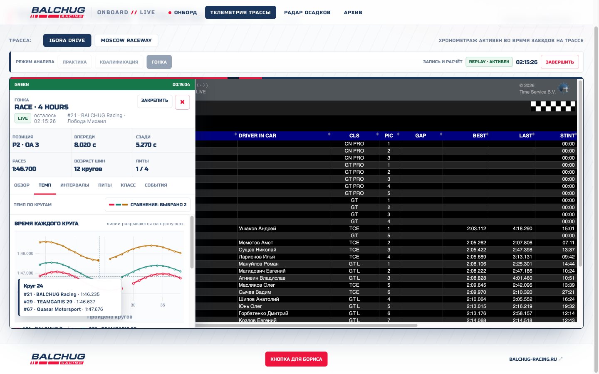

# Live timing engineer dashboard

This document is the implementation contract for GitHub issues #25, #54, #18
and #19. The prototype is the production telemetry page itself with a
disposable client-side fixture enabled by `?demo=1` or the 24-hour upper-bound
fixture by `?demo=24h`. Demo values never reach the timing API or timing
database.

## Operator contract

- Practice and Qualifying have no parameters.
- Race has exactly two parameters: duration (4/6/12/24 hours) and required
  pit stops (2 through 8).
- Authentication is a separate access step. It is not a tactical input and the
  token is retained only in `sessionStorage` until the tab closes.
- The lifecycle controls and tactical dashboard are rendered only when the
  existing `balchug_admin` ("Я Борис") mode is active. Public page loads do not
  initialize timing API or SSE traffic.
- Team, car, driver, class, laps, tyres, flags, gaps, sectors and pit facts are
  always derived from the normalized source feed.
- The dashboard never reads or changes the third-party iframe DOM. Tab and
  comparison changes leave the iframe element and connection in place.

## Annotated wireframes

### Desktop inline layout

```text
+-------------------------------------------------------------------------+
|                    interactive timing iframe                           |
+-------------------------------------------------------------------------+
| session: Practice | Qualifying | Race       lifecycle / time / Stop     |
| flag strip                                                               |
| session / freshness / identity                                           |
| PIC | ahead | behind | last lap | tyre age | pits                        |
| tabs                                  comparison selector                 |
| full-width tactical view / chart / event stream                          |
+-------------------------------------------------------------------------+
```

The dashboard is the next document-flow block after the live timing iframe.
There is no rail, overlay, open/close state, pin action or nested work-surface
scroll. It uses the available page width and does not recreate the iframe.





### Tablet

At tablet width, lifecycle controls wrap into two rows, decision metrics use a
three-column grid and the dashboard remains below the iframe.



### Mobile

Below 768 px the dashboard follows the iframe in normal page scroll. Decision
and metric grids use two columns; charts retain a stable 280 px height. No
fixed panel or body scroll lock is used.



The Race dialog contains only the two permitted race parameters:



## Information hierarchy

1. Flag and source freshness lead the admin dashboard immediately below the
   lifecycle bar.
2. The decision strip exposes PIC/OA, confirmed gaps, source LAST, tyre age and pit
   obligation without scrolling.
3. Tabs separate repeated decisions: Overview, Pace, Intervals, Pits, Class
   and Events.
4. Overview uses full-width bands and bordered metric grids. It does not
   nest cards.
5. Class view prioritizes `PIC | Team/Car | Pace5 | Tyres | Pits | Compare`.
   `Last` is intentionally hidden in the compact panel because it duplicates a
   nearby pace decision and would remove the team identity column.

## Comparison selection

BALCHUG is pinned as the red series. Automatic mode selects at most three
unique cars in this order:

1. class leader;
2. immediate class car ahead;
3. immediate class car behind;
4. nearest remaining PIC when a slot is still free.

Manual mode is display-only. It searches number/team/driver/car, allows up to
three competitors, retains a disappeared selection as `OUT`, and persists by
track/session. Colors are assigned once per participant and reused in every
view: blue, teal, amber, violet. Color is paired with labels, points and line
shape rather than carrying meaning alone.

## Chart contract

`uPlot 1.6.32` is vendored under `web/assets/vendor/uplot`; there is no CDN and
no custom chart engine. Charts use Canvas, `spanGaps: false`, exact points plus
readable lines, a shared cursor sync key, and at most BALCHUG plus three
competitors. The tooltip shows lap, exact value and full team identity.



The API keeps each visible history at no more than 720 points. A local
`?demo=24h` measurement used 720 points and four series:

| Measurement | Result |
| --- | ---: |
| 100 Overview -> Pace switches, p50 | 15.7 ms |
| p95 | 17.3 ms |
| maximum | 29.5 ms |
| heap after idle GC | 4.6 MB |
| retained chart roots/canvases | 1 / 1 |
| canvas nonblank check | 32,598 opaque; 31,159 colored pixels |
| 50 Overview -> Pace -> Pits cycles, p95 after timeline | 10.1 ms |
| heap after timeline interaction sample | 5.9 MB |
| 50 four-tab cycles on live-format 24 h fixture, p95 including four animation frames | 80.5 ms |
| heap after live-format interval interaction sample | 8.9 MB |

The implementation phase in #19 adds source-backed lap, interval, flag and pit
markers without changing these layout or selection contracts.

### Stint and pit timeline

The Pits tab uses the same bounded dashboard-history range for BALCHUG and the
selected competitors. Each row reconstructs on-track stints around confirmed
pit-in/pit-out intervals; a completed stop starts the next tyre stint. The
background shows source flag periods and the right-hand marker is the newest
stored timing slice. A focusable segment tooltip exposes scoreboard time,
stint/stop number, tyre age where calculated, entry/exit laps and measured
pit-lane time. An open stop stays open to the latest slice and is never given a
fabricated duration.

This display is derived entirely from `dashboard/history.pit_stops`, `flags`
and deterministic participant metrics. Changing the comparison selection only
changes the displayed rows and never writes a tactical input.

### Interval continuity

The Intervals tab draws seconds only inside one source-valid class-neighbour
segment. `LAPPED`, non-racing, invalid-source and target-change states arrive
as explicit null points. The client also inserts a null boundary when the
source lap difference changes, either compared car enters a confirmed pit
interval, or an ingest gap overlaps the two observations. uPlot therefore
cannot bridge those periods with a visually plausible but false line.

The lower axis keeps a tick for every BALCHUG lap. Labels use the requested
five-lap step while it fits; a full 12/24-hour overview thins labels only by a
multiple of five to prevent overlap, and zooming restores the five-lap labels.

### Live history tail

The first load and every comparison-selection change request the full bounded
history. Subsequent SSE metric events request a five-minute overlapping tail,
coalesce while one request is in flight, and merge laps, interval boundaries,
pits, flags, ingest gaps and source-clock anchors by stable source identity.
Flag/quality events can force a full reconciliation for late provider history.
This keeps new interval points inside the two-second live budget without
reading and transferring the entire 4/24-hour series every second.

On the active four-hour production race, the full three-car payload measured
284 KB and 305-436 ms. A five-minute tail measured about 10 KB and 27 ms at the
API; the proxied browser cycle, including an artificial 120 ms delay, completed
in 311 ms. Five events received during one delayed request coalesced into one
follow-up request.

## Responsive matrix

| Viewport | Public mode | Boris mode | Decision strip | Metric grid |
| --- | --- | --- | --- | --- |
| 390 x 844 | iframe only | inline below iframe | 2 x 3 | 2 columns |
| 768 x 1024 | iframe only | inline below iframe | 3 x 2 | 3 columns |
| 1440 x 900 | iframe only | full page width | 6 x 1 | 6 columns |
| 2048 x 1152 | iframe only | full page width | 6 x 1 | 6 columns |

## Component states

| State | Header | Main view | Actions |
| --- | --- | --- | --- |
| mode not started | OFFLINE, empty values | explicit start prompt | mode buttons enabled |
| connecting | connecting badge, frozen values | prior snapshot or loader | duplicate start disabled |
| identity unresolved | flag/freshness remain live | strategy suppressed | no identity form |
| no completed laps | position/state if present | timing metrics are dashes | no synthetic zero |
| LIVE | green freshness badge | one-second updates | Stop available |
| STALE >3 s | amber STALE | last values frozen | source warning only |
| OFFLINE >10 s | red OFFLINE | last values frozen | reconnect is automatic |
| heat changed/reset | new generation | complete snapshot/reset | selections retained by session |
| competitor disappeared | unchanged series identity | legend says OUT | manual removal remains available |
| stopped/aborted | OFFLINE | final snapshot, then idle launcher | modes unlock after active read clears |
| replay fixture | Replay badge | deterministic interactive data | never writes API/DB |

## API to view-model mapping

| UI field | API path |
| --- | --- |
| mode/lifecycle/race parameters | `session.*` |
| heat | `heat.external_name` |
| LIVE/STALE/OFFLINE | `freshness.status` |
| flag and flag clock | `measured.track_flag.*`, session metric `flag_phase_elapsed_s` |
| team/driver/car/class/POS/PIC/state | `measured.participants[]` |
| our identity | `session.our_participant_id`, participant `is_ours` |
| Last/Best/Pace3/5/10 | participant metric values; decision strip uses source LAST |
| tyre age/stint | `tyre_age_laps`, `stint_*` |
| completed/required pits | participant `pits_completed`, `session.required_pits` |
| ahead/behind | session metric IDs and `gap_to_ahead_ms/gap_to_behind_ms` |
| comparison rows | participant metrics filtered to our class |
| alerts/events | session `alerts`, stream flag/pit/lap/alert events |
| charts | bounded `dashboard/history` lap, interval, flag, pit and source-time axes |
| stint timeline | `dashboard/history.pit_stops`, `flags`, participant `stint_summary/tyre_age_laps` |

Lifecycle calls use the existing contract: create draft, then start; stop is an
explicit separate action. Each write carries `Authorization: Bearer` and a
fresh `Idempotency-Key`. SSE `snapshot/reset` is applied directly; other
durable events trigger one batched state refresh, never one request per event.

## Tokens

The panel extends existing `site.css` tokens rather than introducing a second
theme:

- panel/paper: `#fff`, `--paper`, `--line`;
- primary text: `--navy`, supporting text: `--muted`;
- BALCHUG/action: `--red`;
- competitors: `#1976b8`, `#148477`, `#b96d00`, `#7356a5`;
- positive operational state: `#16804b`;
- spacing steps: 4, 6, 8, 10, 12, 14, 18 px;
- radii: 4-8 px;
- timing values: tabular numerals; Russo One only for compact headings/data;
- no gradients, decorative blobs, nested cards or moving number animations.

## Accessibility and interaction

- tabs implement `tablist/tab/tabpanel`, arrow keys, Home and End;
- all commands have visible text or an aria-label and a portal tooltip;
- Escape closes the comparison selector;
- dashboard controls remain in normal document tab order after the iframe;
- touch controls are at least 44 px on mobile;
- status meaning is not color-only;
- `prefers-reduced-motion` removes incidental transitions;
- tooltip positioning uses viewport coordinates, flips at edges, and is
  suppressed after pointer activation until the pointer leaves.
